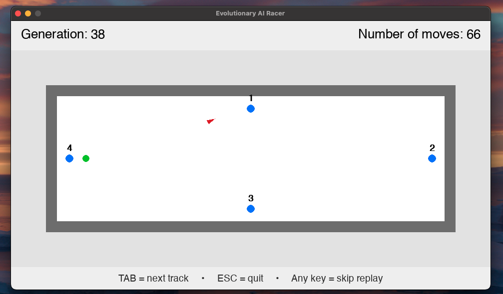

# Evolutionary AI Racer 

An evolutionary AI racing simulator built in Python where autonomous agents learn to navigate a track using **neural networks** and **genetic algorithms**. Agents improve their driving strategies over generations through fitness-based selection, mutation, and crossover.

##  Features
- Neural-network-controlled agents that learn steering and movement
- Genetic algorithm with selection, crossover, and mutation
- Fitness-based evaluation using distance, checkpoints, and survival time
- Replay visualization to analyze agent behavior
- Modular architecture for easy experimentation with new tracks and models
- Configurable parameters for tuning evolution performance

##  How It Works
1. Each agent is controlled by a small neural network.
2. A population of agents is evaluated in a racing environment.
3. Fitness scores are assigned based on progress and efficiency.
4. The best-performing agents are selected for reproduction.
5. Mutation and crossover generate the next generation.
6. Over time, agents evolve more consistent and successful driving strategies.

##  Results
- Improved lap completion rate from near **0%** to over **70%**
- Stable driving behavior achieved after ~300 generations
- Replay tools helped diagnose failure modes and guide parameter tuning

##  Tech Stack
- **Python**
- **Pygame**
- **Neural Networks**
- **Genetic Algorithms**
- **Simulation**

##  Running the Project

##  Simulation Preview




### Requirements
- Python **3.11** (recommended)
- Pygame

### Setup
```bash
python3.11 -m venv venv
source venv/bin/activate
pip install pygame
